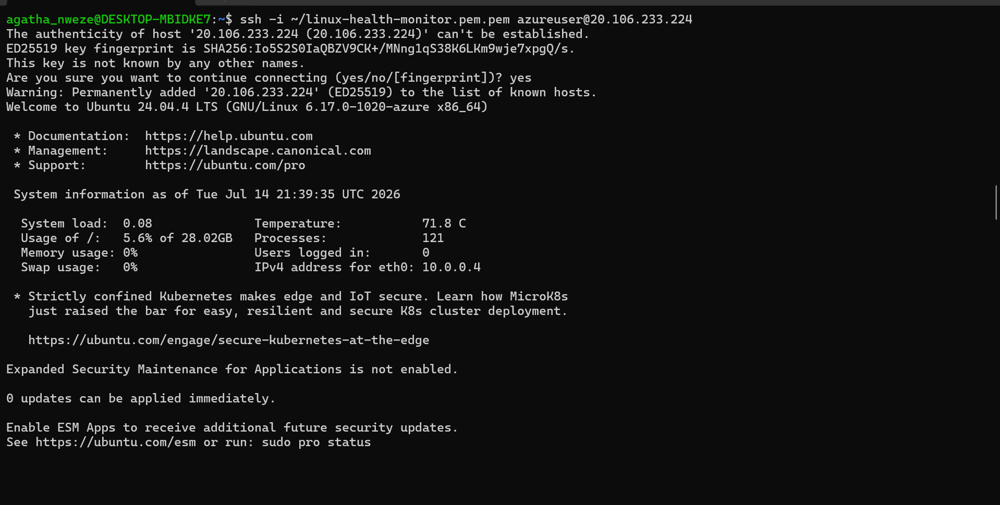
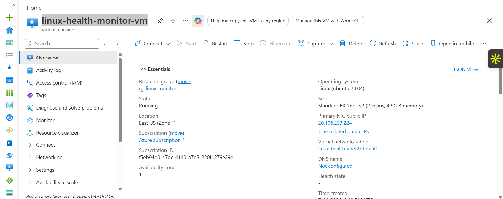
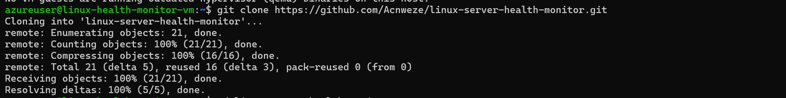
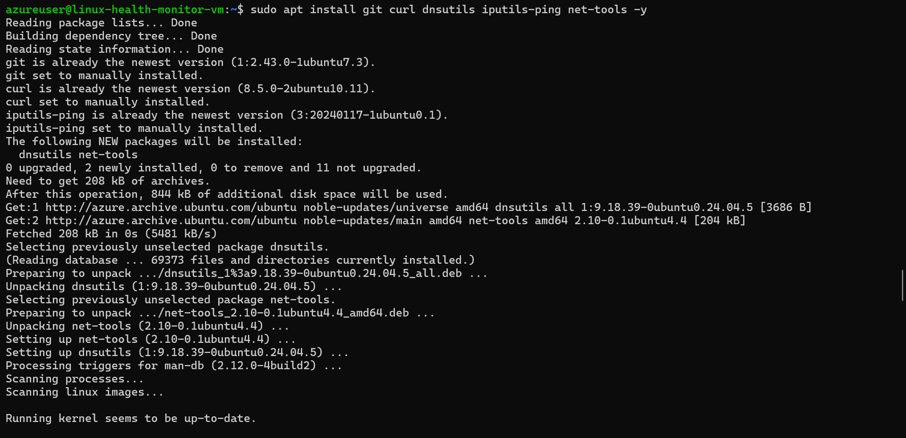
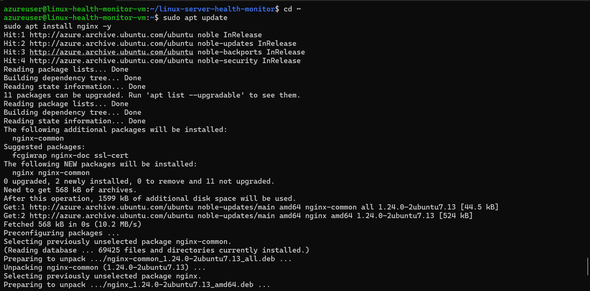
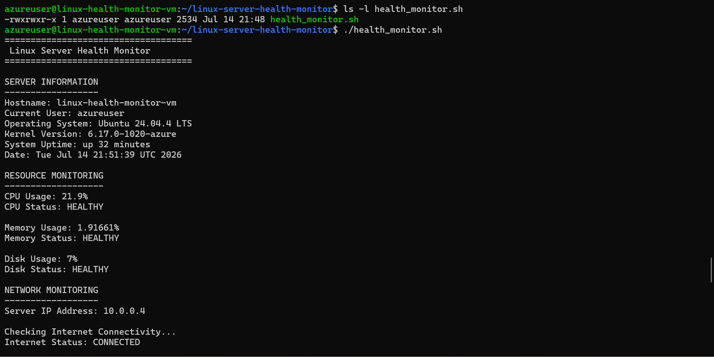
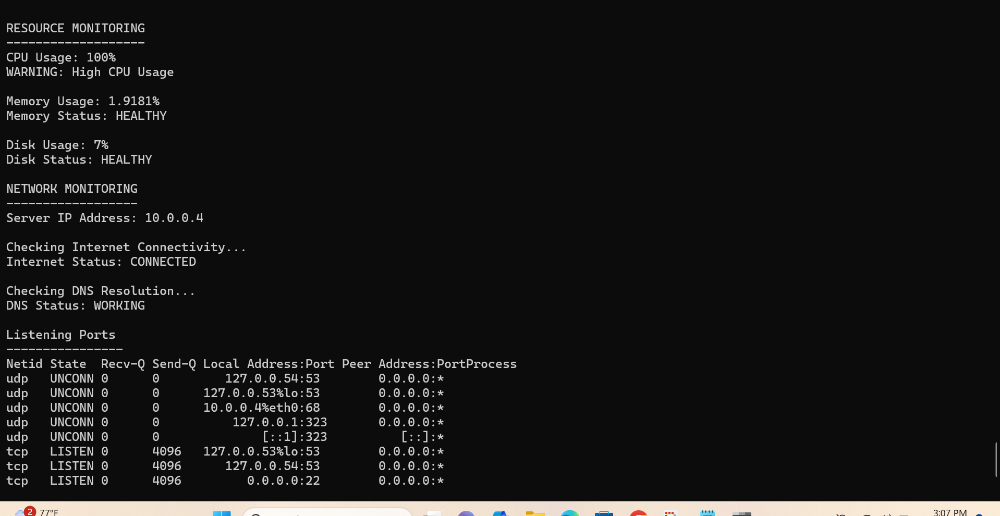
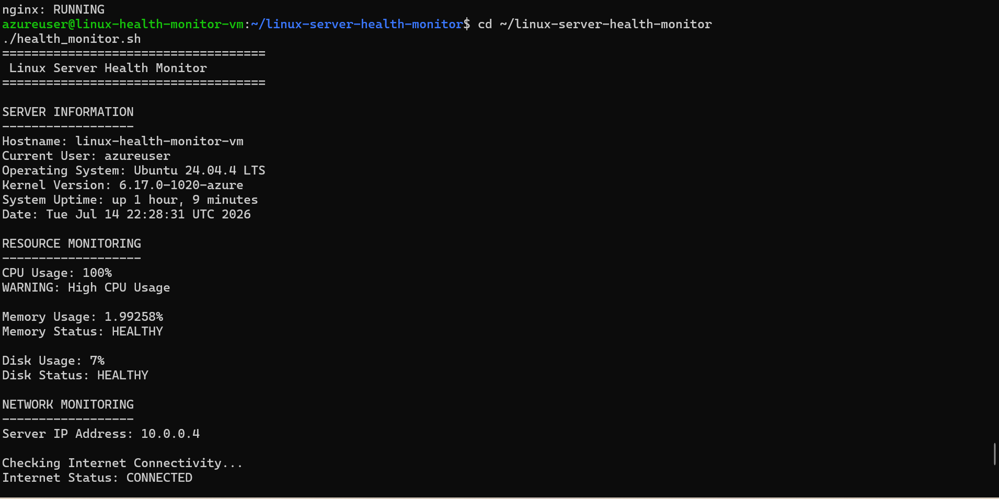

# Linux Server Health Monitor

A Bash-based Linux server health monitoring tool that checks system resources, network connectivity, and running services.

This project was built to demonstrate Linux administration, Bash scripting, networking troubleshooting, and Azure Virtual Machine deployment by creating and testing a real server monitoring solution.

---

# Project Overview

System administrators need visibility into server health to identify resource issues, network problems, and service failures.

The Linux Server Health Monitor automates common Linux server checks and generates a health report directly from the terminal.

The monitoring tool checks:

* Server information
* CPU utilization
* Memory usage
* Disk usage
* Network connectivity
* DNS resolution
* Listening ports
* Running services

---

# Project Architecture

```
Developer Laptop
       |
       | SSH Connection
       |
       v
Azure Ubuntu Virtual Machine
       |
       |
Linux Server Health Monitor
       |
       +-- CPU Monitoring
       |
       +-- Memory Monitoring
       |
       +-- Disk Monitoring
       |
       +-- Network Monitoring
       |
       +-- Service Monitoring
              |
              +-- SSH
              |
              +-- Nginx
```

---

# Technologies Used

* Ubuntu Linux 24.04 LTS
* Bash Shell Scripting
* Microsoft Azure Virtual Machine
* SSH
* Nginx Web Server
* Git & GitHub
* Linux Networking Tools

---

# Features

## System Information Monitoring

The script collects:

* Hostname
* Current user
* Operating system
* Kernel version
* System uptime
* Current date and time

Example:

```
Hostname: linux-health-monitor-vm
Current User: azureuser
Operating System: Ubuntu 24.04.4 LTS
```

---

## Resource Monitoring

The tool monitors:

* CPU usage
* Memory utilization
* Disk usage

Example:

```
CPU Usage: 21.9%
CPU Status: HEALTHY

Memory Usage: 1.9%
Memory Status: HEALTHY

Disk Usage: 7%
Disk Status: HEALTHY
```

---

## Network Monitoring

The script validates:

* Server IP address
* Internet connectivity
* DNS resolution
* Listening ports

Example:

```
Server IP Address: 10.0.0.4

Internet Status: CONNECTED

DNS Status: WORKING
```

---

## Service Monitoring

The script checks important Linux services:

* SSH
* Nginx

Example:

```
SERVICE MONITORING
------------------
ssh: RUNNING
nginx: RUNNING
```

---

# Azure Deployment

The project was deployed and tested on an Azure Ubuntu Virtual Machine.

Deployment environment:

| Component        | Details          |
| ---------------- | ---------------- |
| Cloud Provider   | Microsoft Azure  |
| Operating System | Ubuntu 24.04 LTS |
| Access Method    | SSH              |
| Server User      | azureuser        |
| Web Server       | Nginx            |
| Script Language  | Bash             |

---

# Deployment Steps

## Connect to Azure Virtual Machine

```bash
ssh -i linux-health-monitor.pem.pem azureuser@<public-ip>
```

---

## Clone Repository

```bash
git clone https://github.com/Acnweze/linux-server-health-monitor.git
```

---

## Navigate Into Project

```bash
cd linux-server-health-monitor
```

---

## Install Nginx

```bash
sudo apt update
sudo apt install nginx -y
```

---

## Make Script Executable

```bash
chmod +x health_monitor.sh
```

---

## Run Monitoring Tool

```bash
./health_monitor.sh
```

---

# Screenshots

## Azure VM SSH Connection



## Azure VM Overview



## Repository Clone



## Install Dependencies



## Nginx Installation



## Health Monitor Execution



## Resource Monitoring



## Service Monitoring



---

# Project Structure

```
linux-server-health-monitor
│
├── README.md
├── health_monitor.sh
├── config.conf
├── reports
└── screenshots
```

---

# Skills Demonstrated

* Linux System Administration
* Bash Automation
* File Permissions Management
* SSH Remote Administration
* Azure Virtual Machine Deployment
* Network Troubleshooting
* DNS Troubleshooting
* Service Management
* Git Version Control
* Server Monitoring

---

# Future Improvements

Planned enhancements:

* Add automated email alerts
* Generate scheduled health reports
* Implement Cron job monitoring
* Add logging functionality
* Integrate with Azure Monitor
* Build a monitoring dashboard

---

# Author

Agatha Nweze


```
```

